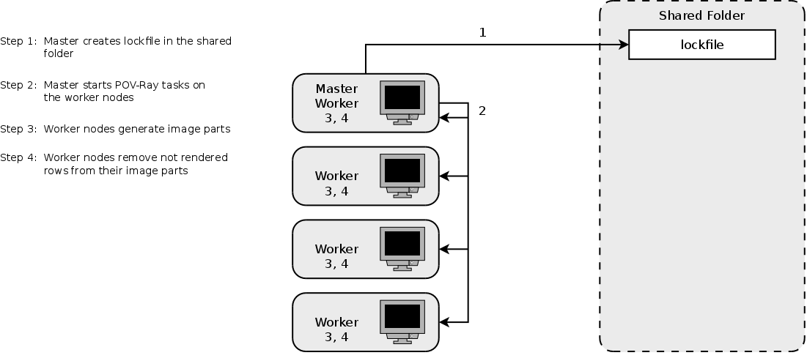
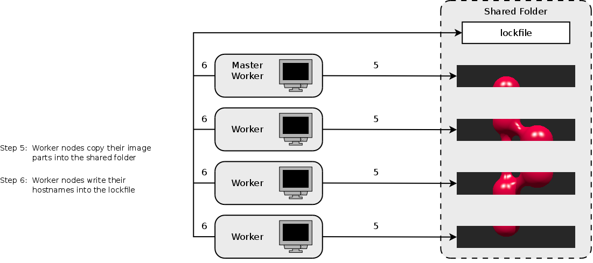
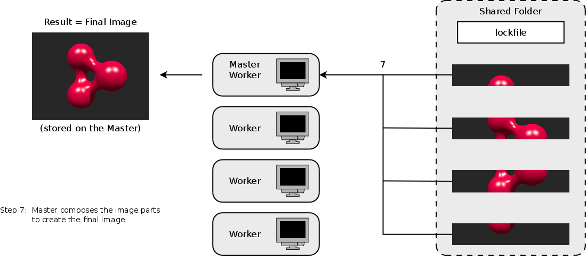
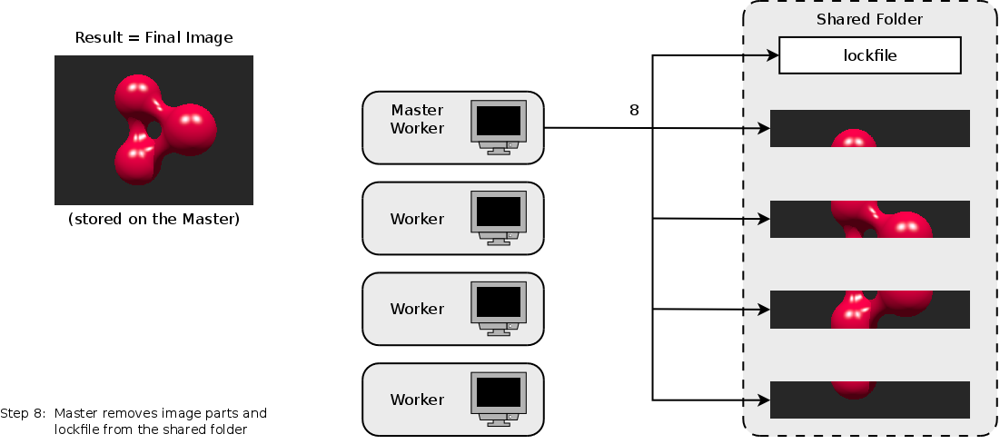

# Task-Distributor - A Task Distributor for Clusters

Task-Distributor is a collection of two bash scripts, which simplify the 
parallel generation of images by using the ray tracing software POV-Ray by using 
multiple worker nodes in parallel. POV-Ray supports to calculate just a part of 
the final image (a limited number of rows). 

## Synopsis

task-distributor-master.sh -n nodes -x width -y height -p path

## Requirements

These software packages must be installed on all worker nodes:

- POV-Ray 3.7
- bash 4.2.37
- ImageMagick 6.7.7
- bc 1.06.95

A shared folder, which can be accessed by the master node and all 
worker nodes must exist, because this shared folder is required to store the 
lockfile and the image parts. The shared folder can be implemented via a 
distributed file system or a protocol (e.g. NFS) 

## Components 

The two shell scripts are in detail:

### task-distributor-master.sh

This script creates a lockfile on a shared folder, which can be accessed by the 
master node and all worker nodes.

As next step, the script starts via ssh a POV-Ray job on each worker node. 

After the POV-Ray jobs have been started, the script checks in an infinite loop 
if each worker node has placed its hostname into the lockfile. If this 
condition is met, the script composes the image parts via the command line tool 
convert from the ImageMagick project to create the final image.

### task-distributor-worker.sh

This script must be located on each worker node because it executes the POV-ray 
render job according to the instructions of the master node and stores the 
resulting image part on a shared folder, which can be accessed by the master 
node and all worker nodes.

It is possible with POV-Ray to render only a subset of **rows** but since POV-Ray 
3.7 the output is always a full height image and not rendered rows are filled 
with black pixels. 

The script removes the black rows with the command line tool convert from the 
ImageMagick project to reduce the network traffic and the amount of data which 
needs the master to process finally for creating the final image.

Finally, the script writes the hostname of the worker node into the lockfile to 
inform the master node that the image part of this worker node is now available.

## Workflow

## Reason for the Development and the Design Decisions

Several options exist when POV-Ray needs to be used in compute cluster. Some projects like MPIPOV or the PVM patch for POV-Ray extended the functionality of POV-Ray in a way that it was possible to use the Message Passing Interface (MPI) or the Parallel Virtual Machine (PVM) for splitting the image computation task into smaller subtasks and distributing them to the nodes of a cluster.

The popular solutions from the 90s are now all broken, because have not been updated since more than 10 years and they do not support recent POV-Ray revisions. This is a major drawback because starting with version 3.7, POV-Ray provides multithreading.
For this reason, I implemented te Task-Distributor, which follows the approach, well described by W.R.Rooney here Povray on a Cluster. This approach just splits the image calculation by row. No modification of the POV-Ray source code is required and the implementation is very simple to understand, install and use.

With POV-Ray it is possible to let each node calculate just a part of the final image by using the options +sr and +er. The behavior of POV-Ray 3.6 and older is well explained here POV-Ray 3.6 Documentation:

* *When rendering a subset of rows (+sr/+er) POV-Ray writes the full height into the image file header and only writed those lines into the image that are rendered. This can cause problems with image reading programs that are not checking the file while reading and just read over the end.* *

A common approach was using PPM as output format and concatenating the resulting parts to the final image by building a PPM file header and assemblng the image parts via the command line too `cat` to the final image.

POV-Ray 3.7 works in a modified way as described here POV-Ray 3.7 Documentation:

* *When rendering a subset of columns (+sc/+ec) and/or rows (+sr/+er), POV-Ray generates a full width image and fills the not rendered columns with black pixels. This should not be a problem for any image reading program no matter what file format is used. Earlier versions of POV-Ray had problems when a subset of rows (+sr/+er) was rendered. The full height information was written into the image file header but it only wrote image data for those lines that were actually rendered. This made output files that were incompatible with various image processing tools. In version 3.7 this is no longer the case.* *

Two options were evaluated during the developlement of the Task-Distributor:

1. Combining the images with each other by using the command line tool `composite` from the ImageMagick project. With `composite -compose lighten imput1.png imput2.png output.png` the pixels of the input images are compared and the lighter values are taken for the output image. This approach causes a lot computation effort on the master.
2. Using the command line tool `convert` from the ImageMagick project to remove the black rows from the image parts. Removing the black rows on worker node site reduces the compute time because this subtask is carried out in parallel. The fact that the master needs lesser data to process, when it composes (also with the command line tool `convert`) the final image from the image parts, also reduces the compute time.

Task-Distributor implements approach number 2.

The amount of data, which needs to be processed by the master and transmitted in the network is reduced by using the output format PNG instead of PPN, because PNG files are smaller in size. Using the output format PNG is possible because the `convert` tool supports this file format PNG.

## Example

`./task-distributor-master.sh -n 8 -x 800 -y 600 -p /glusterfs/povray`

## Web Site

Visit the Task-Distributor for more information and the latest revision.

[https://github.com/christianbaun/task-distributor](https://github.com/christianbaun/task-distributor)

## License

GPLv2 or later.

[http://www.gnu.org/licenses/gpl-2.0.html](http://www.gnu.org/licenses/gpl-2.0.html)
